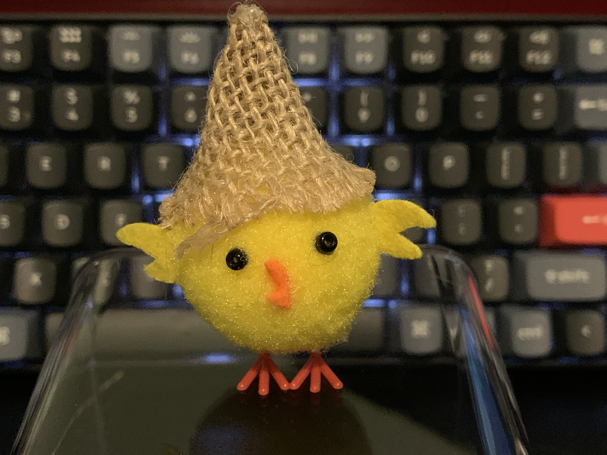

# thursday no, monday, akuku

## ideas
* write "The best scrum master - my definition of scrum", started, created draft
* created idea for application to scrum, better than jira 
* tutorial on yt
  * get your blog fast - with zero money
  * with markdown, github pages
  
## achivments 
* support junior frontend with integration with you leads, still have some frontned skills 
  * https://manual.youlead.io/en/

## challenges
* puplic blog on time, public day 26.02
  * but deliver 

## learnings
* people are like plants, diffrent needs
  * some need more light
  * some more water
  * some need firizer? Cut?
  * Kamil you need to remeber that
* leadership 
  * never panic, no emotions
    * as a leader you need to inspire its 24/7 
    * they always saw you and you have always influence over them
  * be catalysts, like catalysts in chemistry
    * bring individuals together, enhancing interaction and productivity within the team 
    * without exhausting own resources
  * what do You need? after each 1on1
* spanish
 * ayer - yesterday
 * buen provecho - bon appetit

## finds
* Google style guide python
  * [https://google.github.io/styleguide/pyguide.html](https://google.github.io/styleguide/pyguide.html)

Thanks for reading this ❤️

Love,

KK

