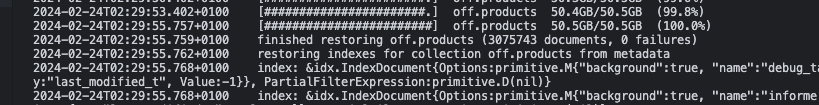

# proud slave

dear colleages,

I am slave and I am proud of it.

could be small drama but some points taken:

[https://www.youtube.com/watch?v=As2aivqvBpk&t=1s&ab_channel=TechLead](https://www.youtube.com/watch?v=As2aivqvBpk&t=1s&ab_channel=TechLead)

but I love programming

nobody will this take from me

it's not about money

## ideas
* create newslatter https://mailchimp.com/pricing/marketing/?currency=EUR
* change blog theme
  * http://jekyllthemes.org/themes/moonwalk/
  * https://the-mvm.github.io/ 
  
## challenges
* go sleep about 3-4AM
  
## achievements
* google analytics on website I SEE YOU 👀
* close work laptop 3 days around 6PM
* migrate some mongodb database for side project 50GB

## learnings
* the three amigos: always of leadership
  * always be deciding
  * always be leaving
  * always be scaling
* google analytics and tag manger basics
* tauri
  * build an optimized, secure, and frontend-independent application for multi-platform deployment.
  * website: https://tauri.app/
  * github: https://github.com/tauri-apps/tauri
  * good reasource always [https://www.youtube.com/watch?v=-X8evddpu7M&ab_channel=Fireship](https://www.youtube.com/watch?v=-X8evddpu7M&ab_channel=Fireship)
* Circuit breaker [design pattern]
  * https://en.wikipedia.org/wiki/Circuit_breaker_design_pattern

thanks for reading this ❤️

your humbled slave,

KK